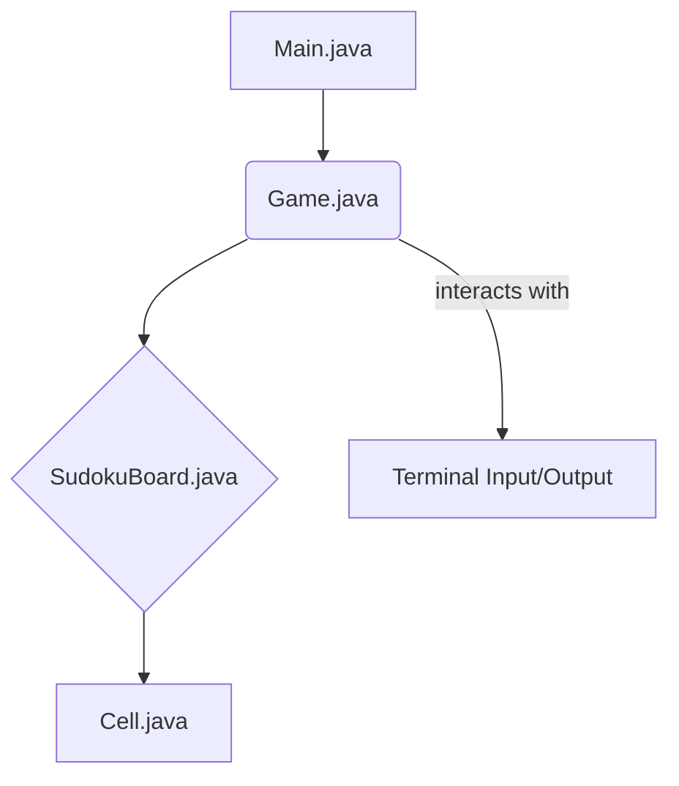

# 🧩 Sudoku no Terminal com Java


Bem-vindo ao repositório do **Sudoku no Terminal**, um projeto desenvolvido com Java puro e executado diretamente pelo terminal. Aqui, aplicamos na prática conceitos de Programação Orientada a Objetos (POO), manipulação de arrays bidimensionais, lógica de validação e interatividade com o usuário — tudo isso em um jogo clássico que desafia o raciocínio lógico!

Welcome to the **Sudoku in Terminal** repository, a project developed with pure Java and executed directly from the terminal. Here, we apply Object-Oriented Programming (OOP) concepts, two-dimensional array manipulation, validation logic, and user interactivity — all in a classic game that challenges logical reasoning!

## ✨ Sobre o Projeto / About the Project

Este jogo simula um tabuleiro de Sudoku no terminal, com suporte a células fixas e preenchimento pelo usuário. Você pode iniciar o jogo com um conjunto de valores já definidos e, a partir disso, interagir em tempo real, preenchendo os espaços vazios com seus palpites.

This game simulates a Sudoku board in the terminal, supporting fixed cells and user input. You can start the game with a predefined set of values and then interact in real-time, filling in empty spaces with your guesses.

Além de reforçar a lógica, este projeto também te ajuda a:

*   Trabalhar com argumentos passados via linha de comando;
*   Compreender encapsulamento e abstração com classes e métodos;
*   Praticar o controle de fluxo e entrada de dados no terminal;
*   Usar boas práticas de estruturação de código em Java.

In addition to reinforcing logic, this project also helps you to:

*   Work with command-line arguments;
*   Understand encapsulation and abstraction with classes and methods;
*   Practice flow control and data input in the terminal;
*   Use good practices for structuring Java code.

## 🚀 Como Executar / How to Run

### Pré-requisitos / Prerequisites

Certifique-se de ter o Java Development Kit (JDK) 11 ou superior e o Apache Maven instalados em sua máquina.

Ensure you have Java Development Kit (JDK) 11 or higher and Apache Maven installed on your machine.

### 1. Clonar o repositório / Clone the repository

```bash
git clone https://github.com/galafis/Criando-um-Jogo-do-Sudoku-em-Java.git
cd Criando-um-Jogo-do-Sudoku-em-Java
```

### 2. Compilar o projeto / Compile the project

Abra o terminal na raiz do projeto e execute:

Open the terminal in the project root and execute:

```bash
mvn clean install
```

### 3. Rodar o jogo com o tabuleiro inicial / Run the game with an initial board

O jogo aceita argumentos no formato `"x,y;valor,fixed"`, onde `fixed` define se a célula é imutável:

The game accepts arguments in the format `"x,y;value,fixed"`, where `fixed` defines if the cell is immutable:

```bash
java -jar target/criando-um-jogo-do-sudoku-em-java-1.0.0.jar "0,0;4,false" "1,0;7,false" "2,0;9,true"
```

Você pode usar o argumento completo fornecido no desafio da DIO para testar com um tabuleiro realista.

You can use the full argument provided in the DIO challenge to test with a realistic board.

## 🎮 Como Jogar / How to Play

*   O jogo exibe o tabuleiro no terminal.
*   Digite as coordenadas `x y` e o valor desejado quando solicitado.
*   Exemplo: `3 1 5` (preenche a célula da coluna 3, linha 1 com o número 5).
*   Para encerrar o jogo, digite `-1` no campo `x`.

Células fixas (pré-preenchidas) não podem ser alteradas.

*   The game displays the board in the terminal.
*   Enter the coordinates `x y` and the desired value when prompted.
*   Example: `3 1 5` (fills the cell at column 3, row 1 with the number 5).
*   To exit the game, type `-1` in the `x` field.

Fixed (pre-filled) cells cannot be changed.

## 🧠 Funcionalidades / Features

*   ✅ Inserção de números com verificação de células fixas / Number insertion with fixed cell verification
*   ✅ Exibição clara do tabuleiro no terminal, com divisões de blocos 3x3 / Clear board display in the terminal, with 3x3 block divisions
*   ✅ Interatividade via terminal / Terminal interactivity
*   🔜 Validação automática da solução (em desenvolvimento) / Automatic solution validation (under development)

## 📁 Estrutura do Projeto / Project Structure

```
Criando-um-Jogo-do-Sudoku-em-Java/
├── src/
│   └── main/
│       └── java/
│           ├── Cell.java         # Representa cada célula do tabuleiro / Represents each cell of the board
│           ├── SudokuBoard.java  # Estrutura e lógica do tabuleiro / Board structure and logic
│           ├── Game.java         # Motor do jogo: leitura e lógica interativa / Game engine: input and interactive logic
│           └── Main.java         # Classe principal que inicializa o jogo / Main class that initializes the game
├── pom.xml               # Gerenciamento de dependências Maven / Maven dependency management
├── LICENSE               # Licença do projeto / Project License
└── README.md             # Documentação do projeto / Project documentation
```

## 💡 Inspiração / Inspiration

Este projeto foi desenvolvido como parte dos desafios propostos pela [Digital Innovation One (DIO)](https://web.dio.me), com base no repositório oficial:

This project was developed as part of the challenges proposed by [Digital Innovation One (DIO)](https://web.dio.me), based on the official repository:

*   [Versão terminal - Branch main](https://github.com/digitalinnovationone/sudoku)
*   [Versão com interface gráfica - Branch ui](https://github.com/digitalinnovationone/sudoku/tree/ui)

## 🧑‍💻 Autor / Author

Desenvolvido por Gabriel Demetrios Lafis, um estudante apaixonado por lógica, aprendizado prático e soluções criativas em Java 🚀

Developed by Gabriel Demetrios Lafis, a student passionate about logic, practical learning, and creative solutions in Java 🚀

## 📄 Licença / License

Este projeto está licenciado sob a Licença MIT. Consulte o arquivo [LICENSE](LICENSE) para mais detalhes.

This project is licensed under the MIT License. See the [LICENSE](LICENSE) file for more details.

## 🏗️ Diagrama de Arquitetura / Architecture Diagram




## 🤝 Como Contribuir / How to Contribute

Contribuições são bem-vindas! Se você tiver sugestões de melhorias, novas funcionalidades ou encontrar algum bug, sinta-se à vontade para abrir uma issue ou enviar um pull request. Por favor, siga as diretrizes de código e garanta que seus commits sejam claros e descritivos.

Contributions are welcome! If you have suggestions for improvements, new features, or find any bugs, feel free to open an issue or submit a pull request. Please follow the code guidelines and ensure your commits are clear and descriptive.

## 🧪 Testes Unitários / Unit Tests

Atualmente, este projeto não possui testes unitários implementados. A adição de testes unitários é uma melhoria planejada para garantir a robustez e a correção do código em futuras iterações.

Currently, this project does not have unit tests implemented. The addition of unit tests is a planned improvement to ensure code robustness and correctness in future iterations.

